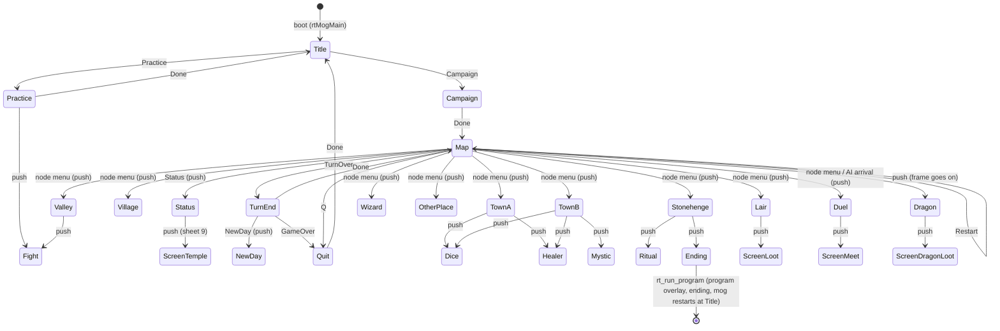

# Game flow: scenes and the scene manager (ROADMAP 9.2a)

Owner request 2026-10-07: "implement the game as state machine for lair, city, map etc." (State pattern, Nystrom's *Game
Programming Patterns*), "they should be separate scenes which handle loading and unloading of assets", and adding a scene must be
easy. Behaviour stays bit-identical: every original call is made in the original order, the frame loops are untouched, and the
boot / play scripts are the proof (section 9).

Code: `include/game/flow/flow.hpp` (the manager's types), `src/game/flow/machine.cpp` (the manager), `src/game/flow/registry.cpp`
(THE scene table and THE transition table), `src/game/flow/check.cpp` (table checks), one scene per file in `src/game/scenes/`,
`src/engine/memstack.cpp` (scene memory), `src/rt/flow.cpp` (the game's instance and its rt ports). Tests: `tests/test_flow.py`.

## 1. The model

- A **scene** is one constant `SceneDef` (no constructor runs): `enter` (load / set up), `run` (the screen's loop; returns an
  **Event**: why it ended), `exit` (tear down), `resume` (back on top after a pushed scene), plus its **asset rows** (what it loads,
  into which buffer) and the list of events it can return or raise.
- The **manager** owns a stack of scenes (depth 8). It is the only code that enters, leaves, suspends or resumes a scene.
- **One transition table**: a row `{from scene, event} -> {op, to scene}`. `run()` never names the next scene, the table does:
  - `Switch`: exit the current scene, enter the target in its place (title -> campaign -> map),
  - `Push`: keep the current scene underneath (suspended), run the target until it pops, then resume the current one,
  - `Pop`: exit the current scene, resume the one underneath,
  - `Halt`: leave the manager (only the host tests' legacy entry; the game never halts).
  Rows for `*` (any scene) are looked up after a scene's own rows (the LAB_04CF sheets are raised from many scenes).
- **Nested screens**: the original is nested calls (the map frame calls the node menu, which calls the place visit, which calls a
  shop screen ...). Where such a call is a screen change, the calling code raises an event (`flowRaise`, or `flowCall` with the
  original call as the *body* that the pushed scene runs). The row must be a `Push`; the target runs to its `Pop` and control
  returns to the raising code exactly where the original call returned, so the call order and the timing do not change. A modder
  redirects or chains screens by editing rows, never the scene that raised the event.

## 2. The scenes

`flow::SceneId` values are fixed (logs, mods and tests name them); new scenes are appended. (`ms::game::SceneId` in
`constants.hpp` is something else: the sheet number `mogSceneId`, LAB_068F, of the screen loop.)

| id | scene (file) | original | entered from (event, op) | leaves to | assets (rows) |
|---|---|---|---|---|---|
| 0 | Title (`title.cpp`) | LAB_0001 head, LAB_00B4, LAB_0152/0156; co-op: Players past 4 = "Coop 2" (ROADMAP 8.2) | boot; Practice / Quit `Done` switch | Practice / Campaign (menu cursor LAB_06DC; a co-op choice turns `g_party` on) | ch.piv (packed) -> screens, sel.cel -> LAB_05C1 |
| 1 | Practice (`practice.cpp`) | LAB_0002 | Title `Practice` switch | Title | message.piv, arena pictures (Test pack), tile set *.t, HE?.ob |
| 2 | Campaign (`campaign.cpp`) | LAB_0001 tail: LAB_01AE, LAB_00D3 knight select (co-op: + a controller per knight, ROADMAP 8.2), SECSTRT_36 | Title `Campaign` switch | Map | (portraits from LAB_05C1) |
| 3 | Quit (`quit.cpp`) | LAB_0064: "game over" text, wait fire, LAB_0DC8 | Map `Quit` (Q key), TurnEnd `GameOver` (no knight left) | Title | message.piv |
| 4 | Map (`map.cpp`) | LAB_0DAB..LAB_0DBC (frame code `mapScreenEnter` / `mapFrame` in `overworld.cpp`) | Campaign, TurnEnd `Done`, itself `Restart` | Status (push), TurnEnd, Quit; node menu / dragon pushes | Test pack picture 9 -> LAB_05C2 -> LAB_05C0, colour jobs |
| 5 | Status (`status.cpp`) | space key: LAB_0DC8, LAB_04CF(9), LAB_0B82 | Map `Status` push | pop -> Map resume (= screen entry) | (the sheet: ScreenTemple) |
| 6 | TurnEnd (`turn_end.cpp`) | LAB_0DB9..LAB_0DBB (`rules.cpp` advanceTurn) | Map `TurnOver` switch | Map (`Done`), Quit (`GameOver`); pushes NewDay | none |
| 7 | NewDay (`new_day.cpp`) | the scheduler's pfnNewDay: LAB_0DC8, LAB_012B, LAB_00EC, LAB_03EB | TurnEnd `NewDay` push (raised inside advanceTurn) | pop -> TurnEnd | ch.piv (packed): "Next Day" + moon |
| 8 | Example (`example.cpp`) | none: `-DMS_EXAMPLE_SCENE=ON` only (section 8) | Status `Done` switch | pop -> Map | HighWood.piv |
| 9 | Village (`village.cpp`) | LAB_00B0 (+ LAB_007B prologue) | Map `Village` push (node menu) | pop | (temple sheet) |
| 10 | TownA (`town_a.cpp`) | LAB_0093..LAB_009A, loader LAB_012E | Map `TownA` push | pop | message.piv, HighWood.piv -> LAB_05C2 -> LAB_05C1 |
| 11 | TownB (`town_b.cpp`) | LAB_008A..LAB_0092, loader LAB_012F | Map `TownB` push | pop | message.piv, WaterDeep.piv |
| 12 | Stonehenge (`stonehenge.cpp`) | LAB_00A1..LAB_00AF | Map `Stonehenge` push | pop; or Ending | message.piv |
| 13 | Valley (`valley.cpp`) | LAB_009D..LAB_00A0, LAB_0DCA, guardian set-up LAB_01A0 | Map `Valley` push | pop | message.piv, Test pack, Demon?.CEL, Gu.a |
| 14 | Wizard (`wizard.cpp`) | LAB_007C, screen LAB_0456, loader LAB_0131 | Map `Wizard` push | pop | WI2.P, WI1.P, Wi1.C, wz.a |
| 15 | OtherPlace (`other_place.cpp`) | LAB_007B prologue only (no place / duel id $21) | Map `OtherPlace` push | pop | none |
| 16 | Dice (`dice.cpp`) | LAB_04A6 | TownA / TownB `Dice` push | pop | tav.piv, dice.piv, dice.cel |
| 17 | Healer (`healer.cpp`) | LAB_048E | TownA / TownB `Healer` push | pop | HEA.piv, mys.cel |
| 18 | Mystic (`mystic.cpp`) | LAB_047C | TownB `Mystic` push | pop | MYS.piv, mys.cel |
| 19 | Ritual (`ritual.cpp`) | LAB_04BF | Stonehenge `Ritual` push | pop | message.piv, Hen1.p, Hen1.c, he.a |
| 20-29 | ScreenMeet, ScreenLoot, ScreenOffer, ScreenSmith, ScreenMarket, ScreenExchange, ScreenTemple, ScreenDragonLoot, ScreenHandOver, ScreenOther (`screen_*.cpp`) | the screen loop LAB_04CF with D0 = 1, 2, 3, 5, 6, 8, 9, 10, 11, other | `*` push (whoever calls LAB_04CF; 8 / 11 inside another sheet) | pop | none (ki.cel / po.cel from boot) |
| 30 | Lair (`lair.cpp`) | LAB_005B (`combat.cpp` fightCreature) | Map `Lair` push (node menu) | pop | message.piv, Test pack, *.t, the creature's cels / bank, KN5.ob |
| 31 | Duel (`duel.cpp`) | LAB_004F (`fightMeet`) | Map `Duel` push (node menu, AI arrival LAB_0E17) | pop | message.piv, Test pack, *.t, HE?.ob |
| 32 | Dragon (`dragon.cpp`) | LAB_0DB6 -> LAB_0083 (`fightDragon`) | Map `Dragon` push (inside the frame) | pop (the frame goes on) | message.piv, Test pack, *.t, DRAGON?.CEL, KN5.ob |
| 33 | Fight (`fight.cpp`) | LAB_0036 on its own | Practice / Valley `Fight` push | pop | none (the caller set the arena up) |
| 34 | Ending (`ending.cpp`) | SECSTRT_5 = rt_run_program | Stonehenge `Ending` push | never returns (overlay switch) | (program overlay: bg*.piv, vmusic.cmp) |

The full row list is `src/game/flow/registry.cpp`; `py -m unittest tests.test_flow` prints it (`ROW from event op to`).

## 3. State diagram

Every pushed scene pops back to the scene that pushed it; the sheets ScreenSmith / ScreenMarket / ScreenOffer / ScreenTemple /
ScreenExchange / ScreenHandOver / ScreenOther are pushed by whoever runs LAB_04CF (rows from `*`).

## 4. What enters what (the original's chain, and where it is now)

- **Overlays** (outermost, `src/rt/game.cpp` rtGameRun): program (intro / ending) <-> mog (the game). This is a state machine of its
  own (`rt_game_next`), switched by an SP unwind (`rt_run_mog`, `rt_run_program` -> `rt_game_leave`). It stays as it is: the
  switch is a non-local exit by design (the original loaded the other overlay over the running one) and the modding agent's
  startup hook (9.4c) lives there. The intro skip (`rt_prg_wait_beam`, `jmp rt_run_mog` from deep in the intro) relies on it too.
- **mog** `rtMogMain` (src/rt/mainloop.cpp): `mainBoot` (SECSTRT_0: 13 set-up routines, the boot loads: message.piv, bold.f,
  Small.font, ch.piv, ki.cel, mi.c, po.cel, kn1-3.ob, blo.cel, the "Test" pack), then `rt::flowRun(Title)`. Before 9.2a the map
  was entered by `rtMogEnterMap` (SP := the loop base, JMP rtOwLoop) and left by `rt_mog_quit` (SP reset, `mainRun(QUIT)`); now the
  manager switches scenes and nothing resets SP inside mog. `rtOwLoop`, `rt_mog_quit`, `rtMogEnterMap` stay for the emulator
  tests of the old chain (and `mainRun` / `mapLoopRun` compose the same scene code for the oracle tests).
- **Map frame** (`mapFrame`, LAB_0DAD..LAB_0DBC): returns NEXT / RESTART / QUIT / STATUS / TURN_OVER; the Map scene turns them into
  events. Inside a frame: the node menu (fire, LAB_0E3D -> LAB_0E45) raises a place / lair / duel (`opPlace` -> `rt::flowPlace`,
  `rtFightCreature`, `rtFightMeet`), the dragon test (LAB_0DB6) raises Dragon; after the pushed scene pops, the frame continues as
  the original did after its JSR (the node menu returns the visit's D0: non-zero restarts the map screen).
- **Places** (`placeVisit`, LAB_007B) are split into `placeVisitBegin` (the prologue; the scene's `enter`) and one function per
  kind (the scene's `run`); `placeVisit` is their composition (tests/test_places_emu.py, test_scene_places.py).
- **Screens** of the towns / places (`rtScrDice/Healer/Mystic/Ritual`), the sheets (`rtScreenRun`, LAB_04CF), the fights
  (`rtFightCreature/Meet/Dragon`, `rtFightRun`) and the ending (`pvRunProgram`) wrap the original call in `rt::flowNested(event,
  body)`: the scene of the event is pushed and runs the body as its `run`.
- **Death / game over**: a lost fight is settled inside the fight scene (`settleDefeats`, the temple sheet); when no human knight
  is left the scheduler returns TURN_GAME_OVER, TurnEnd switches to Quit (the "game over" text, LAB_06E6), then Title.
- **Winning**: Stonehenge with the moonstone of the phase -> Ending (`rt_boot_flags` bit 7, `rt_run_program`): the program
  overlay plays the ending and re-enters mog at its boot (Title).

## 5. Assets and memory

Memory model (owner decision): no AllocMem / FreeMem during play. The arenas taken at start (`src/rt/game.cpp`, docs/MEMORY.md)
are mark / release stacks: the bottom is game lifetime (the boot carve LAB_0004: knights, map state, fonts, the Test pack, the
global sounds), above it scene lifetime. A scene's `enter()` allocates (the `ulBytes` of its asset rows), its exit releases to the
mark taken at enter. `Switch` = release to the scene's mark then enter the new one; `Push` = a new mark above the current scene
(which stays loaded); `Pop` = release to that mark. A scene that does not fit fails at its entry (`rt::fatal` naming the scene and
the bytes), never mid-play; in MS_AUTOPLAY builds every scene exit logs `flow: <scene>: exit, scene memory high water <bytes>`.

The original's fixed buffers stay where they are and are modelled as shared **slots** (`flow::Slot`) that a scene acquires
while it runs and releases when it exits or is suspended under a pushed scene (the manager checks that no running scene holds a
slot another one acquires; a conflict logs `WARN` and counts as an error in the host test):

| slot | buffer | written by |
|---|---|---|
| PicScreen | LAB_05C2 (= LAB_05B9[0] = [11]), 50,000 fast bytes | map backdrop copy (every map entry), place / arena / wizard pictures, Kn5.ob, Mudmen2, Demon1/4 cels |
| Background | LAB_05C0 | map backdrop, arena compose, sheet panels, healer / mystic / ritual pictures |
| Foreground | LAB_05C1 | Sel.cel (title, knight select), town pictures, the arena tile sheet, wi1.p |
| Screens | LAB_0D92 / SECSTRT_35 | every screen; message.piv / ch.piv staging |
| CreatureCels | LAB_05B8[2], 80,000 chip bytes (slots LAB_05E0) | the creature / place cel loaders, dice.piv / dice.cel; LAB_05DF caches what is loaded |
| CreatureBank | LAB_05C8 (the Ratmen / Wizard banks start inside CreatureCels) | the per-creature / place sound banks |
| FightHeap | LAB_05C3 = LAB_0A83 | creature records; the backdrop blob scratch |
| Palette | the live palette, the map's colour jobs | every screen |

Because these buffers are shared, **no scene relies on another scene's leftovers**: every scene (re)loads what it shows when it
is entered or resumed. That is what the original does too (the map re-copies its backdrop on every screen entry; LAB_05DF lets a
loader skip a cel set that is provably still there, which the asset rows note).

**Phase 1 (this task)**: the loads stay exactly where the original made them (same order, same buffers, same timing; the boot
shots prove it). For the top level, the map, the towns (picture loader in `enter`), Status and NewDay the load calls are in
`enter`; for the screens and fights whose loader sits in the middle of the original routine (the arena set-up after the arena
reset, the shop screens' loaders inside the screen routine) the asset rows document what the body loads and the body keeps the
original order. The scene MemStack runs on an empty block (`rt::flowRun` passes base 0, size 0): no scene allocates yet, so the
bookkeeping (marks, release, high water 0, slot balance) is exercised without moving a byte. Phase 2 (not started): give the
MemStack the arena tail above the boot carve once the loaders' scratch use of it is measured, and move the remaining loads into
`enter()` where the original order allows it.

## 6. What stays a loop body

Frame-level loops keep their exact pacing and are the body of their scene's `run`: the map frame (LAB_031F frame wait, the
budget of 2), the fight loop (`fightRun`, 6 ticks per frame, the end timers 35 / 50 frames, the pause key's busy loop), the
screen loop (LAB_04CF, paced by the flip's beam wait), the menus' joystick polling (no wait), the town button loop, the node
menu's key poll (busy, no wait). None of them was restructured.

## 7. Not made a scene (and why)

- **The overlay switch** (program <-> mog, intro, ending playback): a different binary's code with its own scene engine
  (`src/engine/scenes.cpp`); the switch is an SP unwind by design. Documented above; mog's flow ends in the Ending scene.
- **The node menu** (LAB_0E3D): it is part of the map frame (drawn over the map, polled inside the frame); it raises the scenes.
- **The co-op choices** (ROADMAP 8.2): no new scene and no new transition. The title menu's Players item goes on past 4 to "Coop 2"
  (`menuCoopStep`, `src/game/scene_menu.cpp`) and the knight select gets a controller line after each name (phases
  `KP_PAD_RELEASE` / `KP_PAD_CHOICE` of `SceneKnights`); `src/rt/scene_menu.cpp` turns `g_party` (`include/game/party.hpp`) on.
- **The knight select** (LAB_00D3) and the title menu: one screen each inside Title / Campaign (they are already scene-shaped in
  `src/game/scene_menu.cpp`).
- **The wizard's screen** LAB_0456 is the Wizard place itself; **the arena set-ups** are part of their fight scenes.
- **The AI knight's day** (Math's gift, the shop purchase): no screen.

## 8. How to add a scene

1. Write `src/game/scenes/<name>.cpp` with one constant `SceneDef` (copy `example.cpp`): the asset rows, the events `run` can
   end with, `enter` / `run` / `exit`. Pure code: talk to the machine through ops (`FlowOps`, `MainOps`, `MapLoopOps`), never
   hardware.
2. Append its id to `flow::SceneId` (before `COUNT`; never renumber) and its `extern` to `include/game/flow/scenes.hpp`.
3. Add one line to `g_flowScenes` and the rows that reach it and leave it in `src/game/flow/registry.cpp`. No other scene's code
   changes.
4. If it needs an rt port (show a picture, play a sound), add a `FlowOps` entry and fill it in `src/rt/flow.cpp`.
5. `py -m unittest tests.test_flow`: the table checks (every event has a row, every scene reachable, every push can pop, asset
   files exist on the disks).

The example (`-DMS_EXAMPLE_SCENE=ON`, OFF by default, its files are not even compiled without it): after the map's status
sheet, a placeholder scene loads one picture (HighWood.piv) from disk, shows it, waits for fire, and pops back to the map.
What it took: `src/game/scenes/example.cpp` (assets, events, enter = `pfnShowPicture`, run = wait for fire), the rows
`Status Done -> Switch Example` (instead of `Pop`) and `Example Done -> Pop`, one registry line, the `FlowOps::pfnShowPicture`
port (`src/rt/example_scene.cpp`). Proof: `py tools/flow_example.py` builds `build-example/` and runs
`tests/boot/example/example_scene.txt` (shots `build/shots/example/example-{status,picture,map}.png`).

## 9. Tests and proof

- `tests/test_flow.py`: the tables (flowCheck: no problem; dropping any single row or pointing a switch / push row at an
  unregistered id is detected), a run on logging fakes (title -> campaign -> map -> status -> turn over with NewDay -> quit ->
  title: the exact original call order, every enter has its exit, no slot held, memory back at the mark), MemStack and a scene
  that does not fit, the asset files on the disks, the example scene.
- The oracle tests keep comparing the composed pieces with the lifted original: `test_mainloop` (mainRun), `test_boot_map`
  (mapLoopRun), `test_places_emu` / `test_scene_places` (placeVisit), `test_mainloop_emu` / `test_boot_map_emu` (the rt
  entries of the old chain).
- Boot: `py tools/integrate.py --boot --tests auto` (regression + per-commit play scripts, Debug and Release) and
  `--boot-play nightly` (every play script). Code moved, so a byte-identical binary is not expected; the scripts are the proof.
